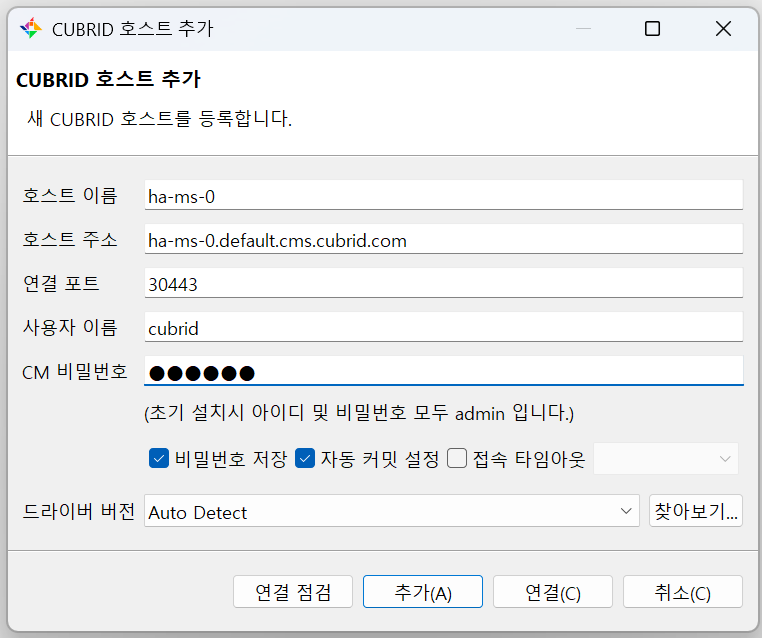

# CUBRID Operator CMS Service Access Guide

## Overview

The CMS service access methods of CUBRID Operator are explained.

CUBRID Operator provides two methods for accessing CMS (CUBRID Manager Server):

### Service Configuration Methods

- **NodePort Service**: Used when `cmsService.type: NodePort` is set
- **Ingress Service**: Used when `cmsService.type: Ingress` is set

The access method is determined by the `cmsService.type` setting, and both methods can be used regardless of HA mode.

## CMS Access using NodePort Service

### Overview
This is a method to access CMS using NodePort service. This method allows simple CMS access without additional infrastructure.

### 1. CR Configuration Example

```yaml
apiVersion: k8s.cubrid.com/v1
kind: CubridDB
metadata:
  name: my-cubrid-db
spec:
  cmsService:
    type: NodePort
    startPort: 31000
    port: 8001
  # ... other settings
```

### 2. Generated Services

NodePort services automatically generated by Operator:
- **Service Name**: `{cr-name}-{namespace}-cms-svc`
- **Port**: CMS port (default: 8001)
- **NodePort**: Assigned sequentially from startPort

### 3. Access Method

```bash
# Check services
kubectl get svc | grep cms-svc

# Example output
# NAME                    TYPE       CLUSTER-IP      EXTERNAL-IP   PORT(S)          AGE
# my-cubrid-db-cms-svc    NodePort   10.96.1.100    <none>        8001:31000/TCP   5m
```

**Access URL**: `http://<node-ip>:<nodeport>`
- `<node-ip>`: IP address of Kubernetes node
- `<nodeport>`: Assigned NodePort number (e.g., 31000)

### 4. NodePort Service in HA Mode

When using NodePort in HA mode, individual NodePort services are created for each pod:

```bash
# Services created in HA mode
kubectl get svc | grep cms-svc

# Example output
# NAME                    TYPE       CLUSTER-IP      EXTERNAL-IP   PORT(S)          AGE
# ha-cubrid-0-cms-svc     NodePort   10.96.1.101    <none>        8001:31000/TCP   5m
# ha-cubrid-1-cms-svc     NodePort   10.96.1.102    <none>        8001:31001/TCP   5m
# ha-cubrid-2-cms-svc     NodePort   10.96.1.103    <none>        8001:31002/TCP   5m
```

Access URL for each pod:
- `http://<node-ip>:31000` (first pod)
- `http://<node-ip>:31001` (second pod)
- `http://<node-ip>:31002` (third pod)

### 5. CMS Access from CUBRID Admin

You can access CMS using CUBRID Admin. Use the "Server Registration" or "Add Connection" feature in CUBRID Admin to enter CMS server information.



**Connection Information Example**:
- **Server Name**: `my-cubrid-db-cms`
- **Host**: `<node-ip>` (Kubernetes node IP)
- **Port**: `<nodeport>` (assigned NodePort number, e.g., 31000)
- **User**: CMS access user account
- **Password**: CMS access password

## CMS Access using Ingress

This is a method to access CMS using Ingress. This method provides advantages such as domain-based access, SSL/TLS support, and load balancing.

### Prerequisites

#### 1. Install Ingress Controller
Ingress Controller must be installed on the cluster.

```bash
# nginx-ingress installation example
kubectl apply -f https://raw.githubusercontent.com/kubernetes/ingress-nginx/controller-v1.8.2/deploy/static/provider/cloud/deploy.yaml

# Verify installation
kubectl get pods -n ingress-nginx
```

### 2. DNS Configuration
DNS configuration is required for the domain name to be used in Ingress.

### 3. Check Ingress Controller Port
Check the HTTPS port number of the Ingress Controller.

```bash
# Check Ingress Controller Service
kubectl get svc -n ingress-nginx

# Example output
# NAME                                 TYPE           CLUSTER-IP       EXTERNAL-IP   PORT(S)                      AGE
# ingress-nginx-controller             LoadBalancer   10.96.1.100     192.168.1.100 80:30080/TCP,443:30443/TCP   5m
# ingress-nginx-controller-admission   ClusterIP      10.96.1.101     <none>        443/TCP                      5m
```

In the above example, the HTTPS port is `30443`.

#### Port Verification Methods

```bash
# Method 1: Check Service details
kubectl describe svc ingress-nginx-controller -n ingress-nginx

# Method 2: Check in YAML format
kubectl get svc ingress-nginx-controller -n ingress-nginx -o yaml

# Method 3: Extract port only
kubectl get svc ingress-nginx-controller -n ingress-nginx -o jsonpath='{.spec.ports[?(@.name=="https")].nodePort}'
```

## Hostname Rules

CUBRID Operator uses the following hostname rules:

```
{pod-name}-{namespace}-{cms.cubrid.com}
```

### Hostname Components

- **pod-name**: Name of CUBRID pod (e.g., `cubrid-ha-0`, `cubrid-ha-1`)
- **namespace**: Namespace where CUBRID is deployed (e.g., `default`, `cubrid`)
- **cms.cubrid.com**: Fixed string `cms.cubrid.com`

### Hostname Examples

```
# First pod in default namespace
cubrid-ha-0.default.cms.cubrid.com

# Second pod in cubrid namespace
cubrid-ha-1.cubrid.cms.cubrid.com

# Master pod in production namespace
cubrid-ha-0.production.cms.cubrid.com
```

## CMS Service using Ingress

When `cmsService.type: Ingress` is set, the Operator automatically creates Ingress resources to access CMS services based on domain. This can be used in both HA mode and single server mode.

### 1. CR Examples

#### Single Server Mode
```yaml
apiVersion: k8s.cubrid.com/v1
kind: CubridDB
metadata:
  name: cubrid-single
  namespace: default
spec:
  cmsService:
    type: Ingress
    port: 8001
  # ... other settings
```

#### HA Mode
```yaml
apiVersion: k8s.cubrid.com/v1
kind: CubridDB
metadata:
  name: cubrid-ha
  namespace: default
spec:
  replication:
    enable: true
    replicas: 3
    hamodeType:
      type: master-slave
  cmsService:
    type: Ingress
    port: 8001
```

### 2. Automatically Generated Ingress and Host Structure

Naming rule for Ingress automatically generated by Operator:
- `{cr-name}-{namespace}-{cms-ingress}`

#### Single Server Mode
In single server mode, only one host is created:

```yaml
apiVersion: networking.k8s.io/v1
kind: Ingress
metadata:
  name: cubrid-single-default-cms-ingress
  namespace: default
spec:
  rules:
  - host: cubrid-single.default.cms.cubrid.com
    http:
      paths:
      - path: /
        pathType: Prefix
        backend:
          service:
            name: cubrid-single-default-cms-svc
            port:
              number: 8001
```

#### HA Mode
In HA mode, hosts for accessing CMS for each pod are automatically added:

```yaml
apiVersion: networking.k8s.io/v1
kind: Ingress
metadata:
  name: cubrid-ha-default-cms-ingress
  namespace: default
spec:
  rules:
  - host: cubrid-ha-0.default.cms.cubrid.com  # cubrid-ha-0
    http:
      paths:
      - path: /
        pathType: Prefix
        backend:
          service:
            name: cubrid-ha-0-default-cms-svc
            port:
              number: 8001
  - host: cubrid-ha-1.default.cms.cubrid.com  # cubrid-ha-1
    http:
      paths:
      - path: /
        pathType: Prefix
        backend:
          service:
            name: cubrid-ha-1-default-cms-svc
            port:
              number: 8001
  - host: cubrid-ha-2.default.cms.cubrid.com  # cubrid-ha-2
    http:
      paths:
      - path: /
        pathType: Prefix
        backend:
          service:
            name: cubrid-ha-2-default-cms-svc
            port:
              number: 8001
```

### 3. Certificate (SSL) Related Annotations in Ingress Resources

Since CUBRID CMS communicates via HTTPS (SSL), the following annotations are automatically added to Ingress created by Operator.

```yaml
annotations:
  nginx.ingress.kubernetes.io/backend-protocol: HTTPS
  nginx.ingress.kubernetes.io/ssl-passthrough: "true"
```

- `nginx.ingress.kubernetes.io/backend-protocol: HTTPS`
  → Indicates that communication between backend (CMS service) and Ingress is HTTPS.
- `nginx.ingress.kubernetes.io/ssl-passthrough: "true"`
  → Passes through (passthrough) SSL connection between client and CMS as-is.

> **Note:**
> Ingress created by CUBRID Operator uses `ssl-passthrough` configuration to
> pass through client's TLS/SSL connection to CMS without terminating it at Ingress.
> Therefore, separate TLS/SSL certificate (secret) configuration in Ingress is not required,
> and CMS manages certificates directly and handles HTTPS communication.

#### Actual Ingress Example Created by Operator

```yaml
apiVersion: networking.k8s.io/v1
kind: Ingress
metadata:
  annotations:
    nginx.ingress.kubernetes.io/backend-protocol: HTTPS
    nginx.ingress.kubernetes.io/ssl-passthrough: "true"
  name: cubrid-ha-default-cms-ingress
  namespace: default
spec:
  ingressClassName: nginx
  rules:
  - host: cubrid-ha-0.default.cms.cubrid.com
    http:
      paths:
      - backend:
          service:
            name: cubrid-ha-0-default-cms-svc
            port:
              number: 8001
        path: /
        pathType: Prefix
  - host: cubrid-ha-1.default.cms.cubrid.com
    http:
      paths:
      - backend:
          service:
            name: cubrid-ha-1-default-cms-svc
            port:
              number: 8001
        path: /
        pathType: Prefix
```

### 4. CMS Access from CUBRID Admin using Ingress

You can access CMS through Ingress using CUBRID Admin. Domain-based access is possible, enabling more intuitive access.

**Connection Information Example**:

- **Server Name**: `cubrid-ha-0-cms` (first pod)
- **Host**: `cubrid-ha-0.default.cms.cubrid.com`
- **Port**: `30443` (HTTPS default port)
- **User**: CMS access user account
- **Password**: CMS access password

## Monitoring and Logging

### 1. Check Ingress Logs

```bash
# Check Ingress Controller logs
kubectl logs -n ingress-nginx deployment/ingress-nginx-controller

# Filter logs for specific host
kubectl logs -n ingress-nginx deployment/ingress-nginx-controller | grep "cubrid-ha-0.default.cms"
```

### 2. Check CMS Service Status

```bash
# Check CMS service list
kubectl get svc -l app=cubrid

# Detailed information for specific CMS service
kubectl describe svc cubrid-ha-0-default-cms-svc
```

### 3. Check Endpoints

```bash
# Check CMS service endpoints
kubectl get endpoints cubrid-ha-0-default-cms-svc

# Check pod connection status
kubectl get pods -l app=cubrid-ha
```

## Troubleshooting

### 1. When Ingress is not working

```bash
# Check Ingress status
kubectl get ingress
kubectl describe ingress cubrid-ha-default-cms-ingress

# Check Ingress Controller status
kubectl get pods -n ingress-nginx
kubectl logs -n ingress-nginx deployment/ingress-nginx-controller

# Check Ingress Controller port
kubectl get svc ingress-nginx-controller -n ingress-nginx
```

### 2. When unable to connect to CMS service

```bash
# Check CMS service status
kubectl get svc | grep cms-svc

# Check service endpoints
kubectl get endpoints | grep cms-svc

# Check pod status
kubectl get pods -l app=cubrid-ha
```

### 3. Port conflict issues

```bash
# Check port usage status
kubectl get svc -o wide | grep 8001

# Use different port to resolve port conflicts
```

### Deployment and Verification

```bash
# Deploy CubridDB CR
kubectl apply -f cubrid-ha.yaml

# Check automatically generated Ingress
kubectl get ingress {CR-Name}-{Namespace}-cms-ingress

# Check Ingress details
kubectl describe ingress {CR-Name}-{Namespace}-cms-ingress

# Check generated hosts
kubectl get ingress {CR-Name}-{Namespace}-cms-ingress -o jsonpath='{.spec.rules[*].host}'
```

### Generated Resources

Resources automatically generated by Operator:

1. **Ingress**: 
2. **CMS Services**: 
   - `cubrid-ha-0-default-cms-svc`
   - `cubrid-ha-1-default-cms-svc`
   - `cubrid-ha-2-default-cms-svc`
3. **Hosts**:
   - `cubrid-ha-0.default.cms.cubrid.com`
   - `cubrid-ha-1.default.cms.cubrid.com`
   - `cubrid-ha-2.default.cms.cubrid.com`

By following this guide, you can safely and efficiently access CUBRID CMS services through Ingress. 